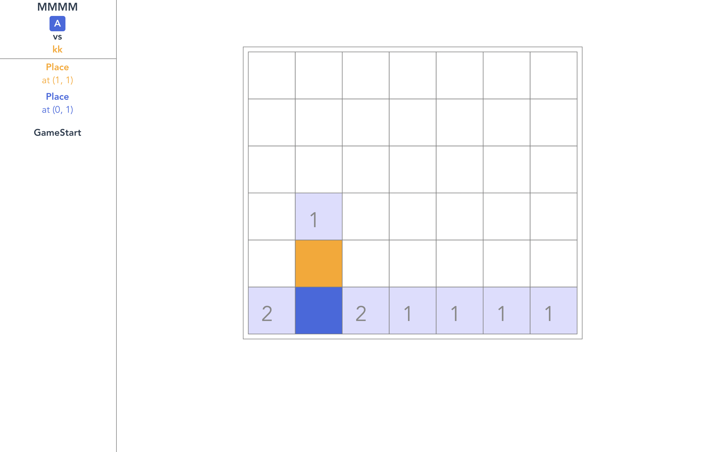

## What?

ネットワーク対戦型重力つき四目並べWebアプリです。
https://moku.corvvs.dev/

## How to Play

アプリにアクセスするとまずマッチング画面が表示されます。

「マッチングする」ボタンを押すと、マッチング待機状態に入ります。\
他に同じようにマッチング待機状態の人がいて、マッチングが成立すると、ゲーム画面に移動します。

ゲーム画面では、プレイヤー同士が交互にパネルを置いていきます。

どちらかが勝つか、置けるスペースがなくなるまでゲームが続きます。

## コードについて

### 構成

Webアプリ部分はVue.js + TypeScriptです。\
Vue.jsはバージョン2系ですが、バージョン3系の機能であるComposition APIを使っています。

また、データベース(Firestore)とホスティングのためにFirebaseを利用しています。

### 開発サーバの起動

1. プロジェクトルートから`/app`フォルダに移動します。
2. `$ npm install` で依存モジュールがインストールされます。
3. `$ npm run serve` で開発用Webサーバが起動します。
4. ブラウザで`http://localhost:8080/`にアクセスすると、ゲーム画面が表示されます。
  - 状況によってはポートが8081ではないかもしれません。

### アプリのデプロイ

Firebaseのアカウントと、Firebaseプロジェクトが必要です。

1. `/.env`と`/.firebaserc`を適切に設定します。
  - それぞれ`/.env.sample`と`/.firebaserc.sample`がリポジトリに入っているので、参考にしてください。
2. `/app`フォルダに移動します。
3. `$ npm run deploy`で、ビルドとデプロイが順に実行されます。
